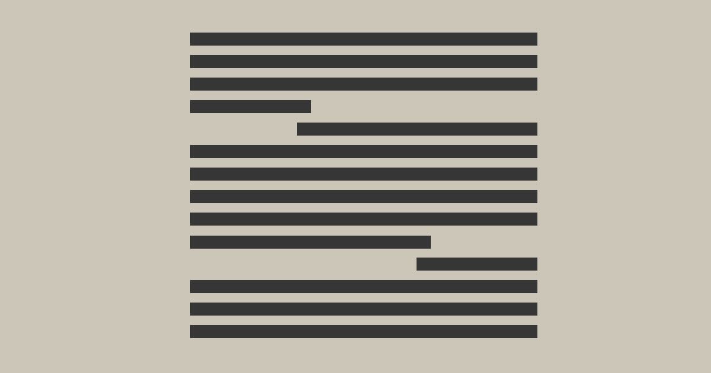
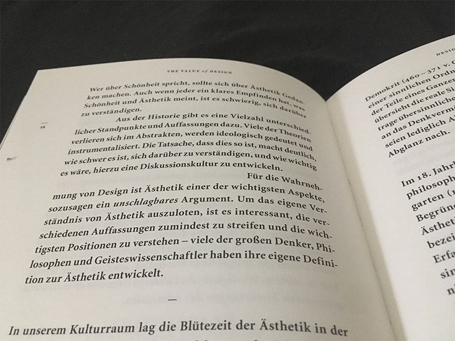

# Floating Indentation
This is an experiment with a flexible text-indent value based on the offset of the last character of the previous line.

__Hey:__ You should probably _not_ use this in a production environment. Especially with a large number of nodes.

## The Idea
I first stumbled about this pattern in [*The Value of Design*](https://typografie.de/produkt/the-value-of-design/) (written by Franz Wagner, typeset by Veronika Kinczli, published at Verlag Hermann Schmidt).

